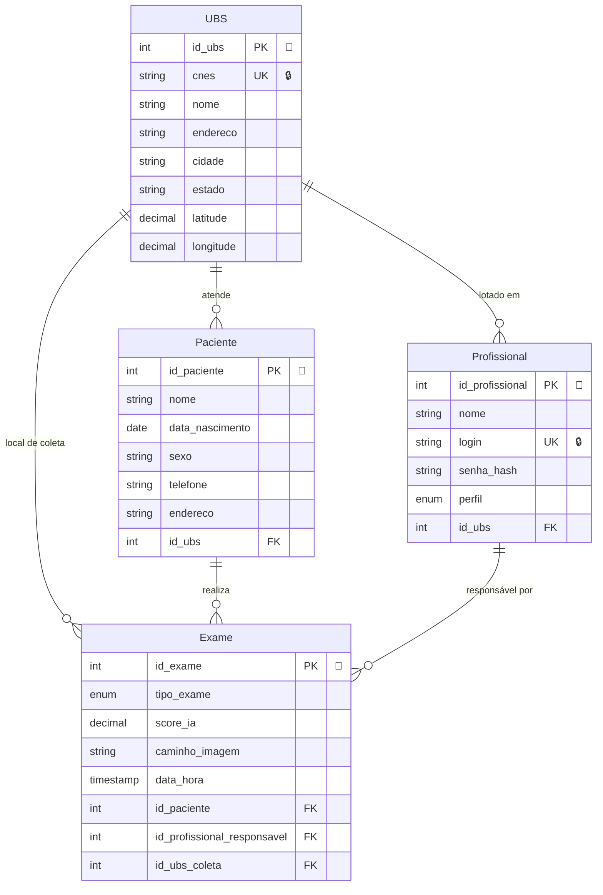

# Banco de Dados - Modelo Entidade-Relacionamento

## Diagrama ER

## Cardinalidades

| Símbolo | Significado |
|---------|-------------|
| ||--o{ | Um para muitos (1 : N) |
| ||--|| | Um para um (1 : 1) |
| }o--o{ | Muitos para muitos (N : N) |
