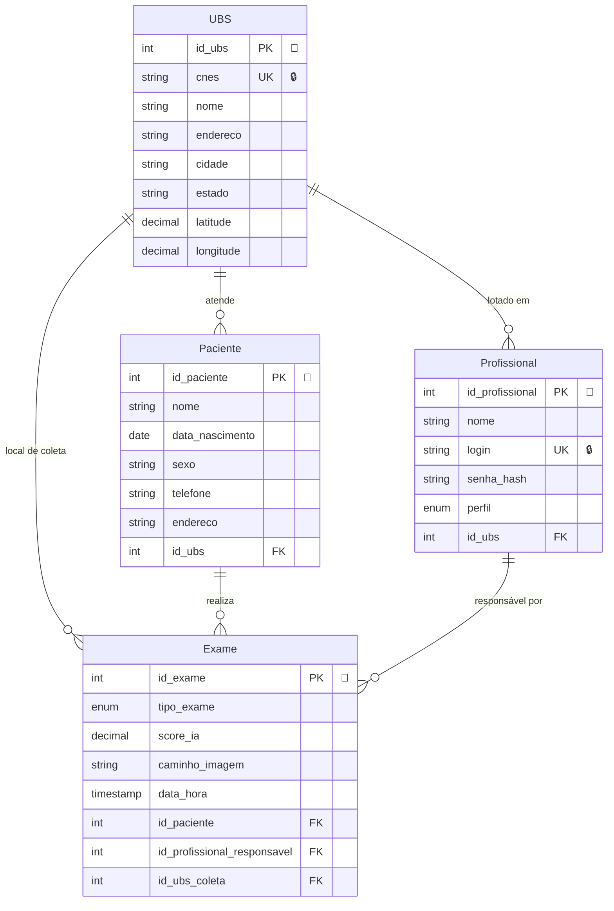

# Meu Projeto - Banco de Dados

## Diagrama Entidade-Relacionamento

## Legenda das Cardinalidades

| Símbolo | Significado |
|---------|-------------|
| `\|\|--o\{` | Um para Muitos (1 : N) |
| `\|\|--\|\|` | Um para Um (1 : 1) |
| `}o--o\{` | Muitos para Muitos (N : N) |

## Relacionamentos

- **UBS** atende muitos **Pacientes**
- **UBS** tem muitos **Profissionais** lotados
- **UBS** é local de coleta de muitos **Exames**
- **Paciente** realiza muitos **Exames**
- **Profissional** é responsável por muitos **Exames**
